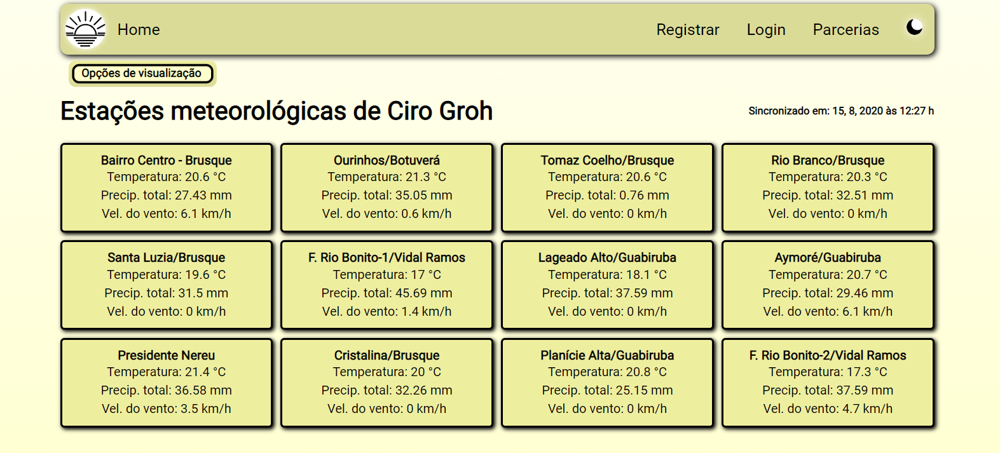
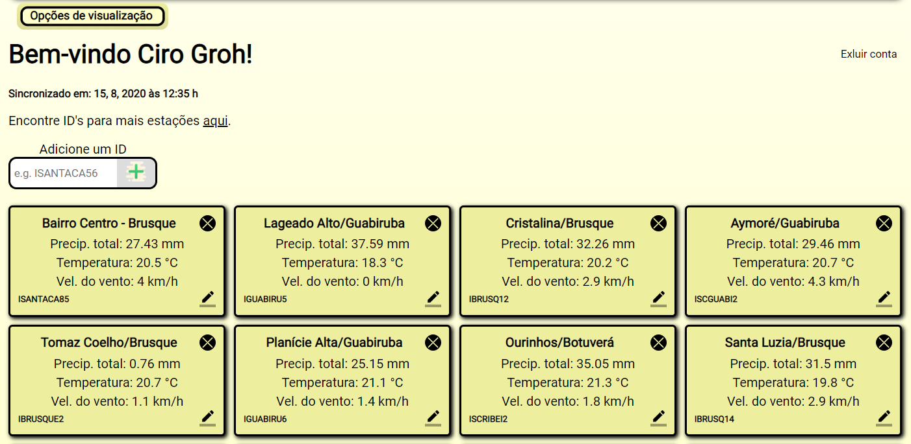

# Web app built to show weather conditions in any chosen place 
 

*You can check this website out [here](https://weatherhome.herokuapp.com/)

* Register to start selecting your weather stations across the world hosted on [Weather Underground](https://www.wunderground.com);  
* Enable dark mode on the top right corner to keep your eyes safe when in a dark room;  

### Home page

### User page (after login)

* By loging in, you enable some options, such as adding new stations to your profile view and some editing options to keep them updated as you wish.